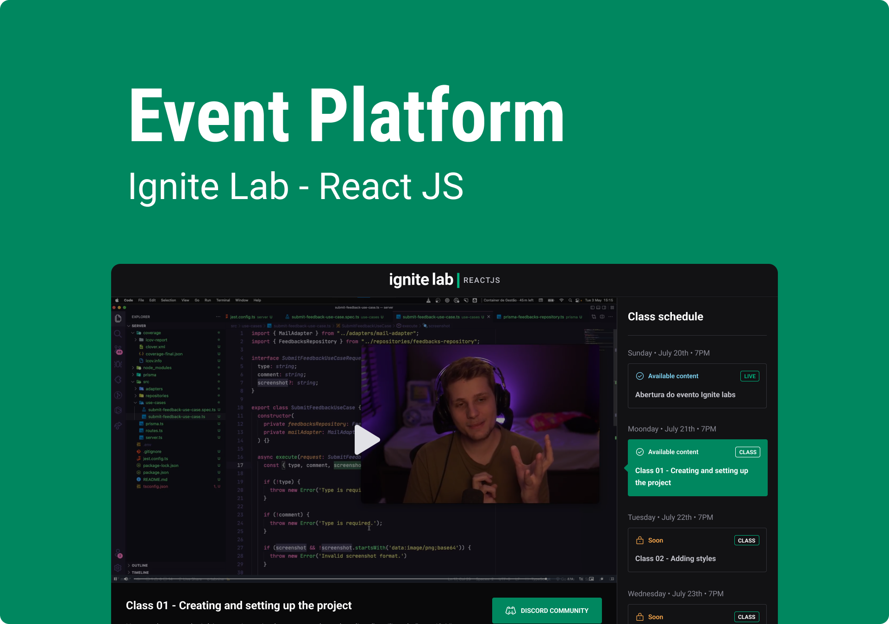
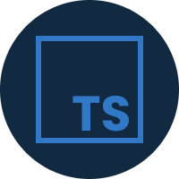
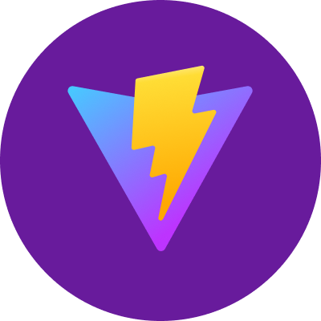
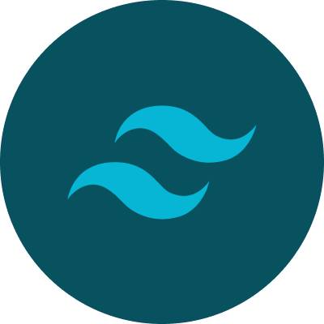

<div align="center">
  <h1>Event Platform</h1>
</div>

<p align="center">
  <a href="#about">About</a>&nbsp;&nbsp;&nbsp;|&nbsp;&nbsp;&nbsp;
  <a href="#technologies">Technologies</a>&nbsp;&nbsp;&nbsp;|&nbsp;&nbsp;&nbsp;  
  <a href="#layout">Layout</a>&nbsp;&nbsp;&nbsp;|&nbsp;&nbsp;&nbsp;
  <a href="#usage">Usage</a>
</p>



## About
The project is a platform to watch classes from an event.

## Technologies
### React
[](https://reactjs.org/)

### Typescript
[](https://www.typescriptlang.org/)

### ViteJS
[](https://vitejs.dev/)

### TailwindCSS
[](https://tailwindcss.com/)

## Layout
You can access the Figma template [here](https://www.figma.com/file/77zI6t2ddkG3AEaZBtMQT3/Ignite-Lab-2.0-(Rocketseat)?node-id=0%3A1).

## Usage
Since this project uses [Graph CMS](https://app.hygraph.com/) service as the backend, you'll need to create an account on their platform and use [this link](https://rseat.in/lab-graphcms) to create a copy of the schema used in this project. When you're done doing the last two steps, you'll have to create a `.env` file on the project's root directory and put the API_URL and API_ACCESS_TOKEN in it. You can get those informations browsing throught the settings page of your Graph CMS project.

Here's a template of the environment variables you'll need to set:
```javascript
VITE_API_URL=YOUR_API_URL_HERE
VITE_API_ACCESS_TOKEN=YOUR_API_ACCESS_TOKEN_HERE
```

After that you can run `yarn` to install all the dependencies and then run `yarn start` to start the project.